# ADS-B-Guided Weak-Target Radar Tracking Under Low SNR and Clutter

## Executive summary

Across all four ADS-B days at detection thresholds -5/0/3/6 dB, the Stage 08 Kalman baseline produced **323,808 true** and **815 false** confirmed tracks. The selected method — a **track-calibrated deterministic sequence autoencoder** (Stage 12.5, `mlp_dae`) — retained **97.3%** of true tracks while removing **99.39%** of false tracks, keeping only **5 of 815**.

> **Final claim.** A track-calibrated deterministic sequence autoencoder trained on ADS-B-derived aircraft trajectory windows suppresses low-threshold clutter-induced false tracks across four days while retaining true aircraft tracks.

`gru_ae` is a close second (97.2% retention, 97.91% reduction, 17 false tracks kept) and is the stronger choice at the lowest threshold. Stage 09 hand-designed physics scoring remains the recommended interpretable fallback.

## Problem

A radar detector must pick a detection threshold, and neither end of that dial is safe:

- a **high threshold** suppresses clutter but loses weak targets;
- a **low threshold** recovers weak targets but floods the tracker with clutter, which   associates into large numbers of false tracks.

Per-frame reasoning cannot resolve this, because a clutter point and a weak target look alike in a single frame. **Trajectory-level reasoning can**: real aircraft motion has a shape over time that clutter chains do not reproduce. This project asks how far that idea can be pushed, and what it costs.

## What the project does

```text
Real OpenSky ADS-B trajectories
  -> cleaned fixed-wing GA trajectories        (F01, stages 01-04)
  -> relocated radar-coordinate truth          (F02, stage 05)
  -> noisy / cluttered radar point detections  (F02, stage 06)
  -> threshold / Kalman / physics / learned-prior evaluation  (F03, stages 07-17.5)
```

**Scope, stated plainly:**

- There is **no raw RF/IQ** anywhere in this project.
- There is **no true range-Doppler intensity simulation**.
- The radar model is a **point-detection simulation**: per-scan detections with   range/azimuth/elevation/radial-velocity measurement error, an SNR-dependent   probability of detection, and Poisson clutter.
- Consequently, the "pseudo range-Doppler" figures below are **scatter plots of point detections** in (radial velocity, range) space. This is a pseudo range-Doppler point-detection visualization, not a raw range-Doppler intensity heatmap.

## Data and simulation pipeline

**F01-Preprocessing** turns raw OpenSky ADS-B into uniform 10 s fixed-wing GA trajectories: aircraft-type whitelisting (01), filtering (02), cleaning (03) and resampling onto a common time grid (04).

**F02-Radar** converts those trajectories into radar observables. Stage 05 builds WGS84 radar truth and can **relocate** trajectories so their start anchors fall in a 10-80 km annulus around a synthetic radar — preserving the real ADS-B motion shape while placing the engagement geometry under experimental control (per-trajectory sha256-seeded anchors, so the relocation is deterministic). Stage 06 simulates point detections: R^-4 SNR decay, a logistic probability of detection, per-component measurement noise, and Poisson clutter.

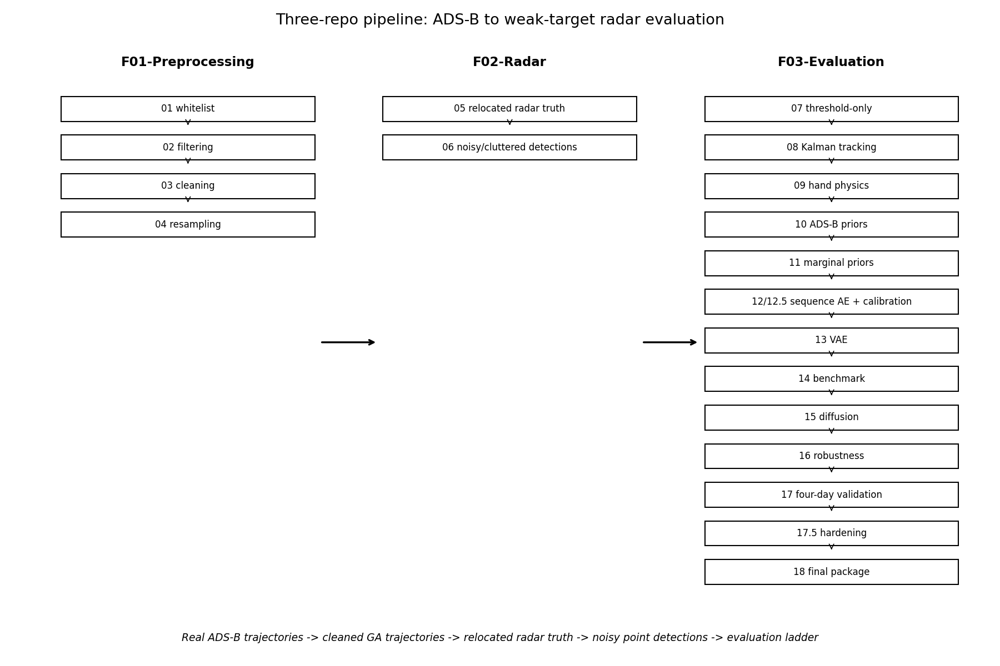

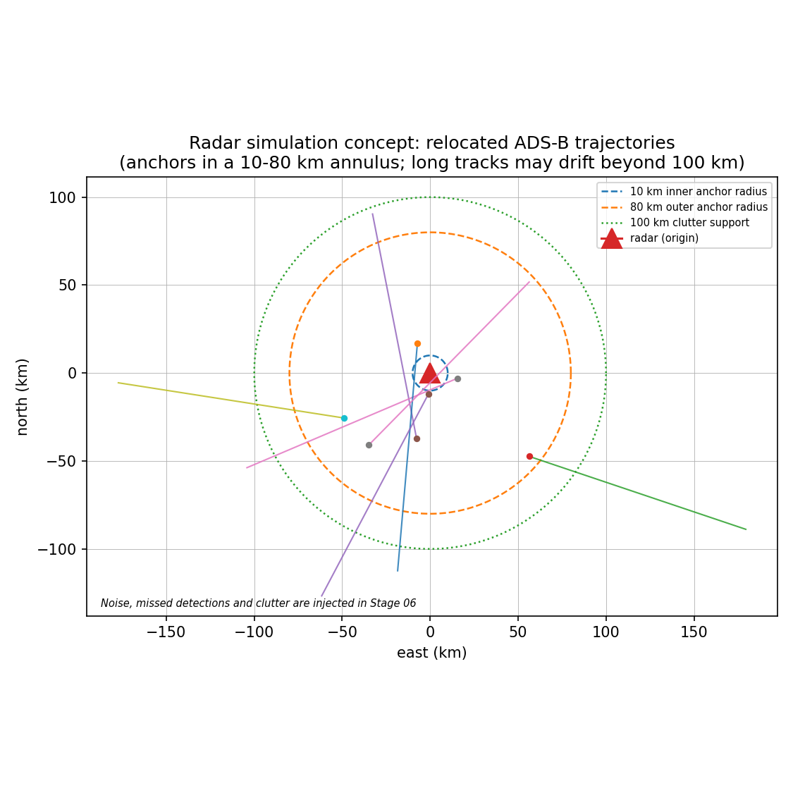

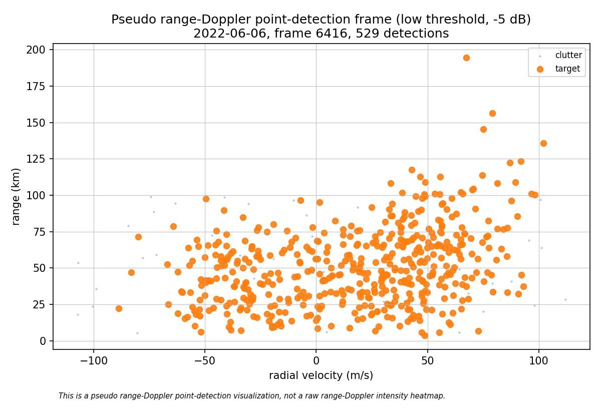

*This is a pseudo range-Doppler point-detection visualization, not a raw range-Doppler intensity heatmap.*

## Evaluation ladder

| stage | method | role |
|---|---|---|
| 07 | threshold-only detection | frame-level tradeoff, no tracking |
| 08 | constant-velocity Kalman + greedy gated NN | track-level baseline / denominator |
| 09 | hand-designed physics scoring | interpretable fallback |
| 10 | empirical ADS-B motion priors | prior construction (no scoring) |
| 11 | empirical marginal-prior scoring | evidence, not sufficient alone |
| 12 / 12.5 | sequence autoencoders + noise-matched calibration | **selected method** |
| 13 | VAE trajectory prior | does not beat 12.5 |
| 14 | unified benchmark + operating-point selection | method choice |
| 15 | diffusion denoiser | regularization / gap filling, not filtering |
| 16 | robustness + ablations | stability of the choice |
| 17 / 17.5 | four-day validation + reproducibility hardening | generalization |

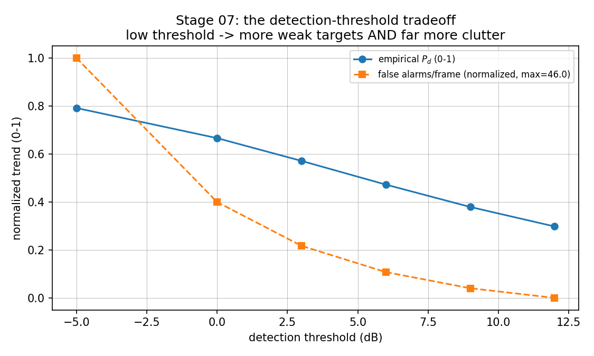

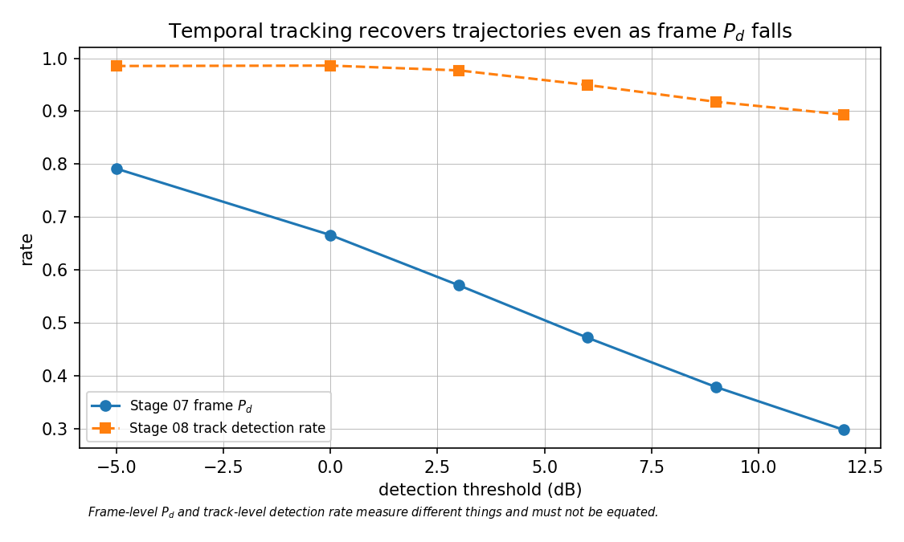

Frame-level $P_d$ and track-level detection rate measure different things; the ladder keeps them separate throughout.

## Final selected method

**Stage 12.5 — a deterministic sequence autoencoder with noise-matched calibration.**

1. Trajectory windows (length 20, stride 5) are origin-shifted and heading-rotated, so    the model learns motion *shape*, not absolute position or bearing.
2. An MLP denoising autoencoder is trained on **clean** stage-05 truth windows.
3. A track is scored by the **median per-window reconstruction error** of its Kalman    posterior.
4. Crucially, the error-to-score mapping is calibrated on **high-purity noisy Stage 08    tracks**, not on clean truth — this is the **noise-matched calibration** step.

Step 4 is what makes the method usable. Calibrated against clean truth, the score separates true from false tracks superbly but is *miscalibrated*: genuine tracks are Kalman posteriors over noisy measurements, so they reconstruct worse than clean truth and collapse toward score 0. Retention at threshold 0.5 was ~0.08. Re-anchoring the p50/p99 band on noisy high-purity tracks lifted retention to ~0.96 with essentially no loss of false-track suppression.

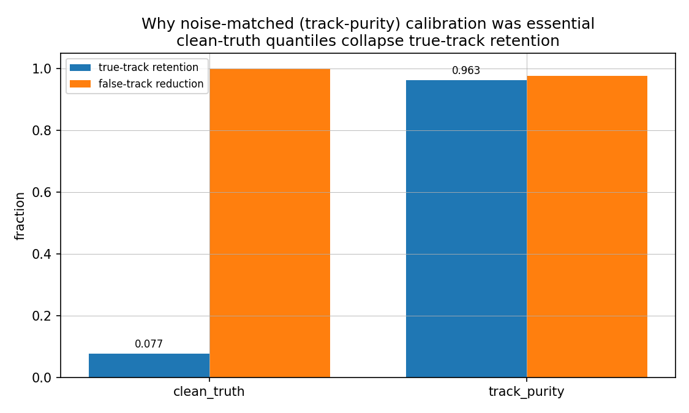

The score itself never sees truth labels. Labels are used only to *select* the calibration set and to evaluate — a limitation recorded explicitly below.

## Results

### Headline claims

| claim_id | claim | stage | evidence_file | metric | value | interpretation |
|---:|---:|---:|---:|---:|---:|---:|
| C1 | Threshold-only detection exhibits a frame-level tradeoff | 07 | stage07_threshold_only/threshold_overall.csv | empirical_pd / false_alarm_per_frame at low vs high threshold | 0.792@46.0 -> 0.298@2.72 | lowering the threshold buys detections at the cost of heavy clutter |
| C2 | Kalman tracking recovers trajectories but leaves false tracks | 08 | stage17_four_day_validation/four_day_stage08_context.csv | false tracks over 4 days at -5..6 dB (stage-08 own labels / strict+windowable evaluation denominator) | 34,773 / 815 | temporal association restores trajectories yet clutter still forms false tracks. The two counts are DIFFERENT populations: stage 08 labels every confirmed track (purity >= 0.5), whereas the filters are evaluated on the stricter, windowable subset (purity >= 0.8 and long enough to window). All filter metrics in this package use the second denominator. |
| C3 | Hand physics scoring is strong and interpretable | 09 | stage17_four_day_validation/interpretable_fallback_comparison.csv | mean stage-09 false reduction (defined cells) | 0.6315 | transparent rule-based scoring removes a large share of false tracks |
| C4 | Empirical marginal ADS-B priors are discriminative but insufficient | 11 | stage11_adsb_prior_scoring/adsb_prior_metrics_by_threshold.csv | mean false reduction at score 0.5 | 0.0012 | marginal priors alone do not beat hand physics |
| C5 | Noise-matched deterministic sequence autoencoders are the strongest method | 12.5 / 17 | stage17_four_day_validation/four_day_summary_overall.csv | pooled false reduction / true retention (4 days) | 0.9939 / 0.973 | mlp_dae keeps 5 of 815 false tracks |
| C6 | The VAE does not beat the deterministic autoencoders | 13 | stage13_vae_prior/vae_metrics_by_threshold.csv | mean VAE false reduction vs stage-12.5 | 0.9798 | probabilistic latent model matches but does not exceed stage 12.5 |
| C7 | Diffusion helps regularization/gap filling but not primary filtering | 15 | stage15_diffusion_denoising/diffusion_gap_filling_metrics.csv | mean gap-fill improvement over linear interpolation | 0.0826 | useful as a denoiser/regularizer; secondary as a classifier |
| C8 | Four-day validation confirms stage 12.5 generalizes | 17 | stage17_four_day_validation/stage17_four_day_validation_report.md | days with complete results | 4 | the single-day limitation from stage 16 is closed |
| C9 | Reproducibility hardening completed | 17.5 | stage17_four_day_validation/stage17p5_repro_hardening.md | regression checks passing | 12 | sys.executable, calibration protection, undefined-cell handling, ignore rules |

### Method comparison

| method | stage | type | primary_role | true_retention | false_reduction | false_tracks_kept | precision_after | scope | conclusion |
|---:|---:|---:|---:|---:|---:|---:|---:|---:|---:|
| Kalman only | 08 | classical tracker | baseline / denominator | 1 | 0 | 815 | nan | four-day (-5..6 dB) | no filtering; keeps all false tracks and so defines the denominator (strict, windowable population) |
| Hand physics scoring | 09 | rule-based | interpretable fallback | 0.9807 | 0.6315 | nan | 0.9779 | four-day (-5..6 dB) | strong, transparent, no training; beaten on false reduction by stage 12.5 |
| ADS-B marginal priors | 11 | empirical prior | evidence, not sufficient | 1 | 0.0012 | nan | 0.9539 | ONE-DAY (2022-06-06) | discriminative but does not clearly beat stage 09 |
| Sequence AE (MLP-DAE), track-calibrated | 12.5 | learned sequence prior | PRIMARY false-track filter | 0.9731 | 0.9939 | 5 | 1 | four-day (-5..6 dB) | selected method |
| Sequence AE (GRU-AE), track-calibrated | 12.5 | learned sequence prior | strong alternative | 0.9722 | 0.9791 | 17 | 0.9999 | four-day (-5..6 dB) | close second; best at low thresholds |
| VAE prior (elbo) | 13 | probabilistic latent prior | not selected | 0.9705 | 0.9798 | nan | 1 | ONE-DAY (2022-06-06) | matches but does not beat stage 12.5 |
| VAE prior (reconstruction) | 13 | probabilistic latent prior | not selected | 0.9704 | 0.9798 | nan | 1 | ONE-DAY (2022-06-06) | matches but does not beat stage 12.5 |
| Diffusion residual classifier | 15 | DDPM denoiser residual | secondary / regularizer | 0.8786 | 0.5948 | nan | 0.9985 | ONE-DAY (2022-06-06) | useful for denoising/gap filling; clearly worse as a filter |

Scope is labelled per row: Stage 12.5 numbers are **four-day**; methods evaluated on a single day are marked `ONE-DAY`. Four-day values are never replaced by stale single-day values.

> **Which false tracks?** Two false-track populations appear in this project and must not be conflated. Stage 08 labels *every* confirmed track by its own criterion (purity >= 0.5), giving 34,773 false tracks over four days and four thresholds. The filters are evaluated on the stricter, **windowable** subset (purity >= 0.8 and long enough to form a window): **815 false tracks**. Every retention/reduction number in this package — including the headline — uses that second denominator, and the Kalman-only row is the no-filter baseline on the same population.

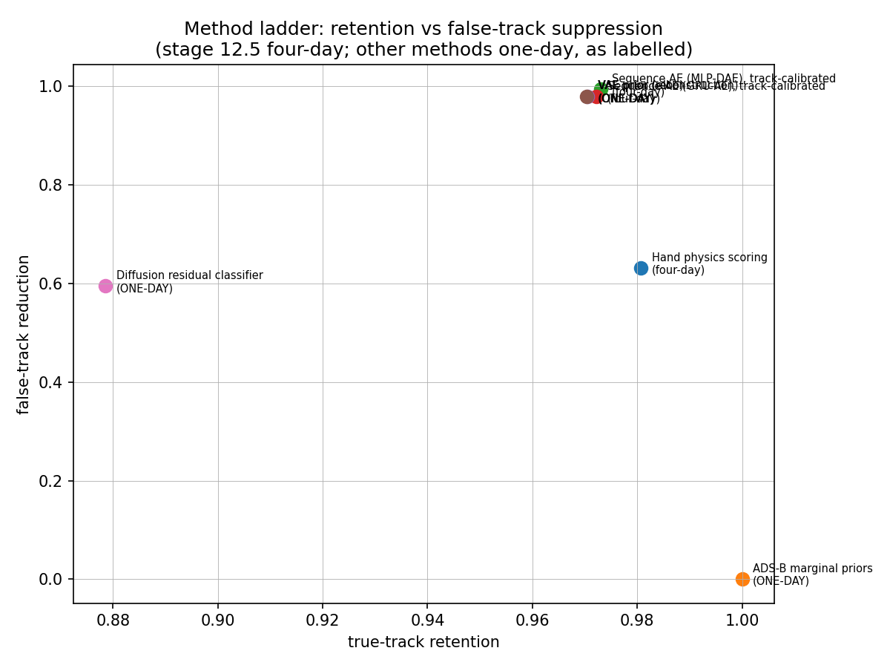

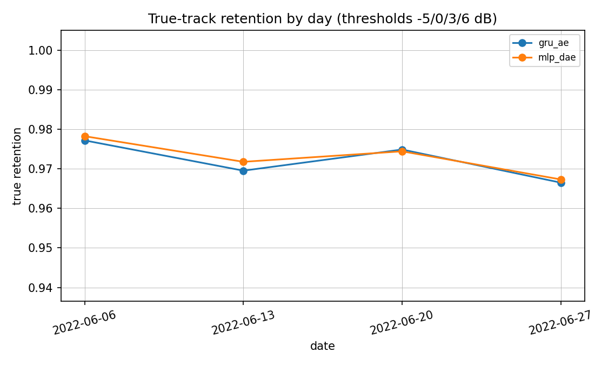

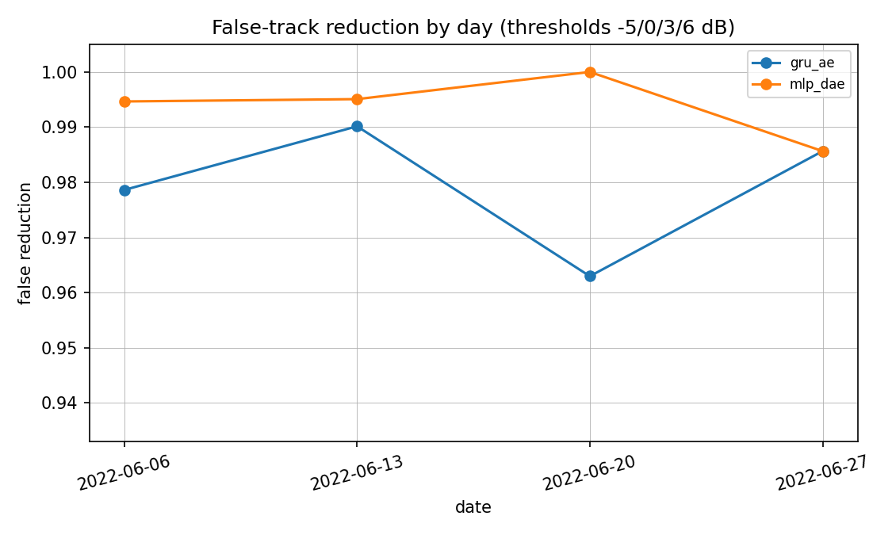

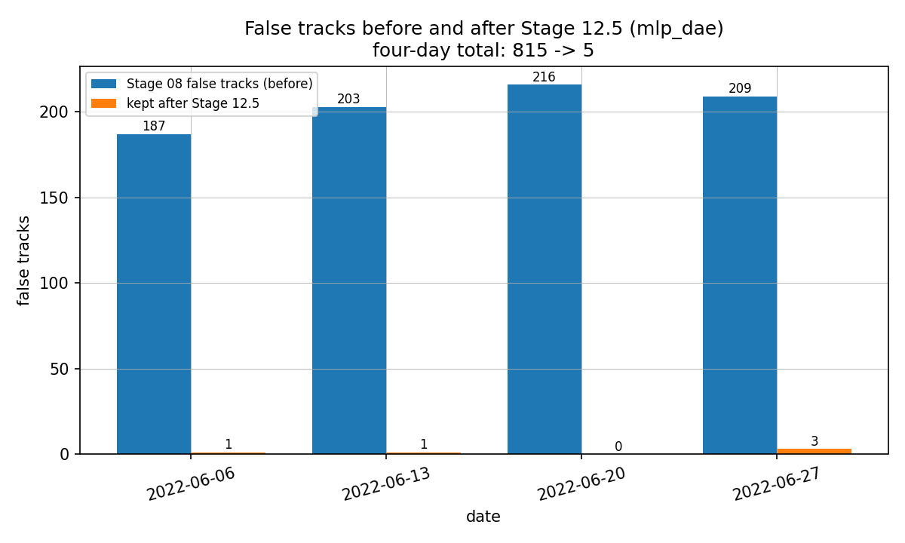

The 815 -> 5 reduction is the central empirical result.

## Ablations

| ablation | comparison | winner | evidence | interpretation |
|---:|---:|---:|---:|---:|
| Calibration | clean-truth vs track-purity (noise-matched) | track_purity | stage16_robustness/calibration_ablation.csv | true retention 0.077 -> 0.963: clean-truth quantiles under-retain noisy tracks; noise-matched calibration fixes the domain shift |
| Model family | MLP-DAE vs GRU-AE vs TCN-AE | mlp_dae | stage16_robustness/model_ablation_mlp_gru_tcn.csv | MLP and GRU are close and strong; TCN retains fewer true tracks |
| Learned vs interpretable | stage 09 hand physics vs stage 12.5 | stage 12.5 | stage17_four_day_validation/interpretable_fallback_comparison.csv | stage 12 removes more false tracks in 14/14 defined cells (2 undefined); stage 09 retains slightly more true tracks and stays the interpretable fallback |
| Probabilistic latent | stage 12.5 vs stage 13 VAE | stage 12.5 | stage13_vae_prior/vae_prior_report.md | the VAE matches but does not beat the deterministic autoencoder; ELBO adds nothing over reconstruction error |
| Generative denoiser | stage 12.5 vs stage 15 diffusion residual | stage 12.5 | stage15_diffusion_denoising/diffusion_denoising_report.md | diffusion regularizes tracks and modestly improves gap filling, but is clearly worse as a primary false-track classifier |
| Windowability caveat | high thresholds (9/12 dB) vs -5/0/3/6 dB | n/a (denominator effect) | stage17_four_day_validation/windowability_four_day_audit.csv | sequence methods only score windowable tracks; at 9/12 dB there are ~0 windowable false tracks, so false-reduction is undefined and cross-method comparison is not apples-to-apples there |

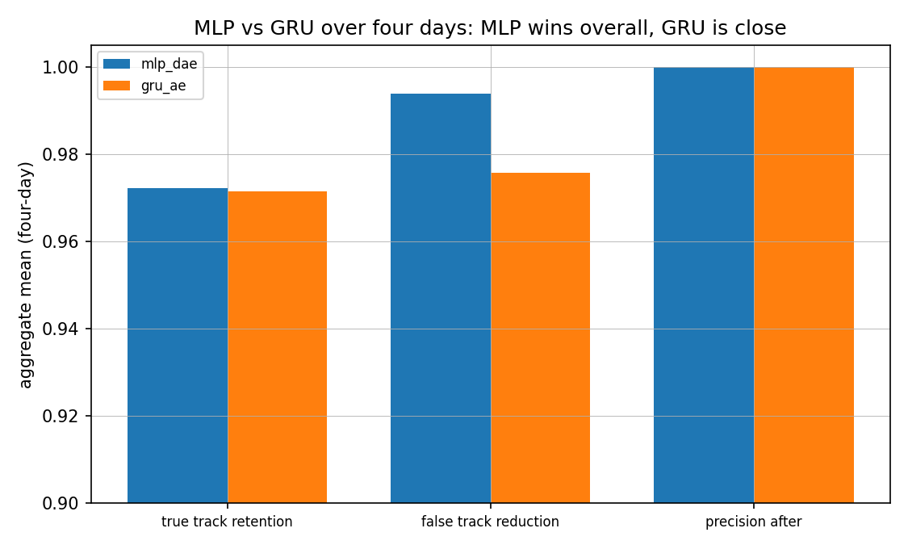

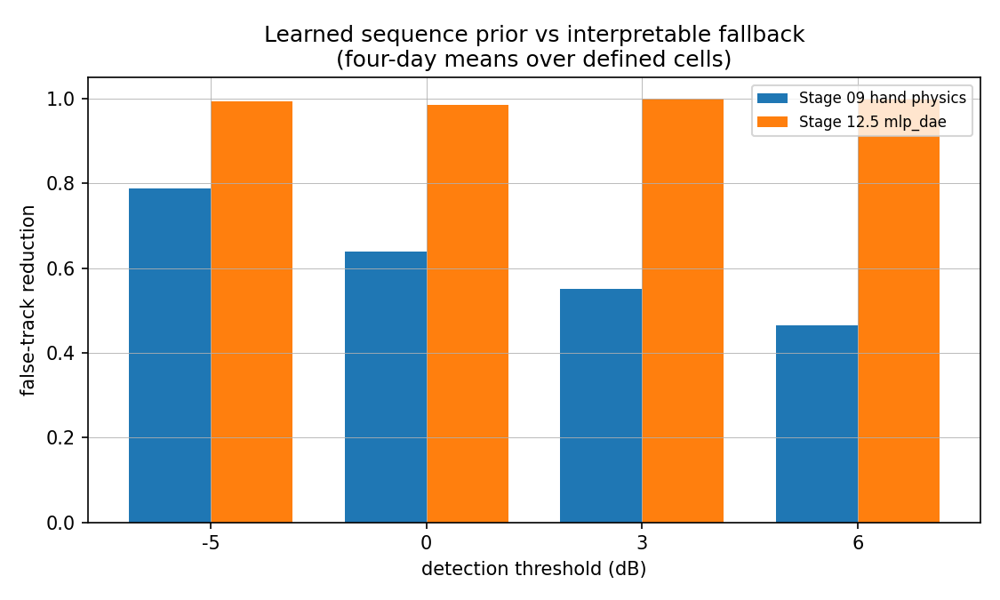

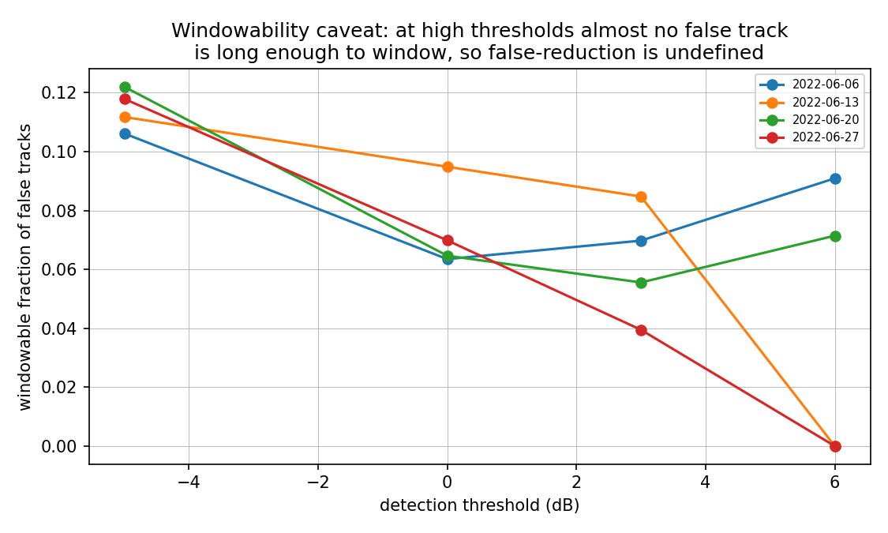

**Windowability caveat.** Sequence methods only score tracks long enough to window (>= window_len points, >= 5 hits). At 9/12 dB almost no false track is that long, so the false-reduction denominator is zero and the metric is **undefined** — not 0, not 1. Those thresholds are kept audit-only, and undefined cells are excluded from aggregates and counted separately.

## Reproducibility

| item | status | evidence | notes |
|---:|---:|---:|---:|
| Deterministic SHA-256 derived seeding in stages 05/06/10 | yes | F02 stage-05/06 relocation + stage-10 reservoir sampling | full-pipeline rerun reproduced every count and metric exactly |
| All stage validation gates green | yes | each stage script prints a VALIDATION GATE block | gates fail loudly rather than emitting inconsistent reports |
| Stage 17.5 regression checks pass | yes | scripts/17p5_regression_checks.py | 12 assertions incl. a negative control for the bare-`python` guard |
| Canonical stage-12 calibration protected | yes | reports/stage17_four_day_validation/stage17p5_repro_hardening.md | --calibration-output defaults to <report-dir>/calibration/; orchestrators sandbox it |
| Internal subprocesses use sys.executable | yes | scripts/16_robustness_ablation.py, scripts/17_four_day_validation.py | a bare `python` does not exist on all machines |
| Undefined false-reduction handled explicitly | yes | utils/common.py safe_reduction/undefined_reason | zero denominator -> NaN + reason, never 0/1 and never blamed on stage 09 |
| Large CSVs / checkpoints git-ignored | yes | .gitignore + git check-ignore | track files, per-track score CSVs and .pt checkpoints are never committed |
| Four-day validation rerun succeeded | yes | reports/stage17_four_day_validation/ | stage-08/09/12.5 generated for all four days; gate enforced gap closed |
| Code committed and pushed through the final stage | yes | git log / remote origin | each stage committed with compact reports; large artifacts excluded |

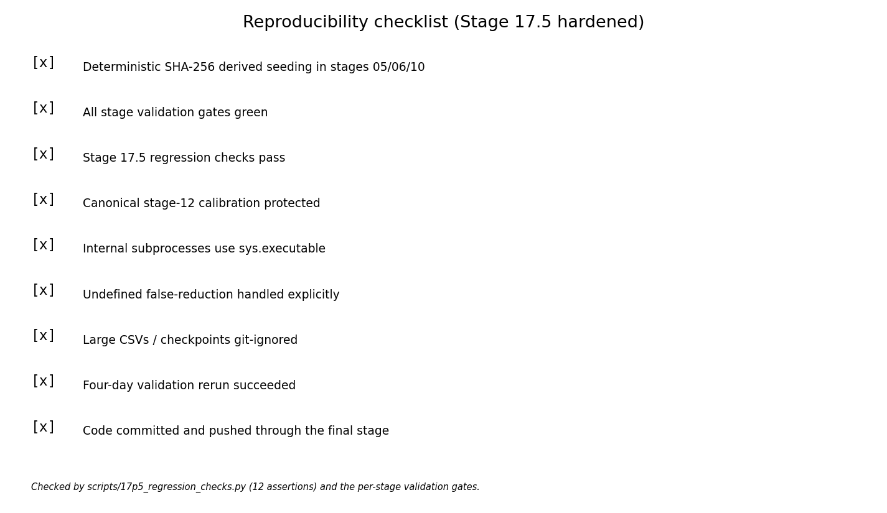

Stage 17.5 hardened the pipeline after defects surfaced during the four-day run: internal subprocesses now use `sys.executable`; the canonical Stage 12 calibration can no longer be overwritten by a per-day rerun; zero-denominator false-reduction cells are explicitly undefined rather than mislabelled; and 12 regression checks (including a negative control) guard all of it. The scientific results were unchanged by that pass — only labels, paths and diagnostic columns.

## Limitations

| limitation | impact | mitigation_or_future_work |
|---:|---:|---:|
| Point-detection radar simulation, not raw RF/IQ | Detection-level realism only; no waveform, sidelobe, or receiver effects | A raw RF/range-Doppler intensity simulation would test the detector itself |
| Pseudo range-Doppler figures are point-detection scatter plots | They must not be read as radar intensity maps | Generate true RD heatmaps only if gridded intensity data is simulated |
| Synthetic relocation of trajectories near the radar | Motion shape is real ADS-B; radar geometry/engagement is synthetic | Deploy against a real radar site with co-located ADS-B truth |
| OpenSky ADS-B-derived fixed-wing GA focus | Conclusions are scoped to light general-aviation motion | Extend to rotorcraft, UAS, and manoeuvring military profiles |
| High-threshold windowability caveat (9/12 dB) | Sequence methods have ~0 windowable false tracks there; reduction is undefined | Compare only at -5/0/3/6 dB, or use a length-matched denominator |
| Track-purity calibration uses truth labels to SELECT calibration tracks | The score itself never sees labels, but calibration-set selection does | Use a purity proxy (e.g. self-consistency) to make calibration fully unsupervised |
| Learned-method evidence is on simulated detections, not real radar returns | Absolute numbers will not transfer directly to a fielded radar | Validate on recorded radar detections with ADS-B truth |
| Diffusion and VAE were not tuned exhaustively | Their negative results are for the configurations tested, not the families | A scoped sweep could revisit them if a specific gap emerges |
| Runtime / deployment not optimized | Throughput and latency for an operational system are unmeasured | A deployment-style runtime and operating-point study |

## Novelty and contribution

The novelty is **not** in Kalman filtering, autoencoders, or radar thresholding individually. The contribution is an ADS-B-grounded weak-target radar evaluation framework and a noise-matched learned trajectory-shape scoring method that suppresses low-threshold clutter-induced false tracks while retaining true aircraft tracks.

| contribution_id | contribution | novelty_level | supporting_evidence |
|---:|---:|---:|---:|
| 1 | An ADS-B-grounded weak-target radar simulation and evaluation framework (real trajectories -> radar truth -> noisy point detections -> evaluation ladder) | integration / framework | F01 stages 01-04, F02 stages 05-06, F03 stages 07-17.5 |
| 2 | Synthetic relocation that preserves ADS-B motion shape while controlling radar geometry (per-trajectory sha256-seeded anchors) | methodological | F02 stage 05 (--relocate-near-radar), reports/relocated_experiment_audit.md |
| 3 | A baseline ladder from threshold-only detection through Kalman tracking, hand physics, empirical priors, sequence autoencoders, VAE, and diffusion | systematic evaluation | reports/stage14_method_benchmark/stage14_method_benchmark_report.md |
| 4 | Noise-matched (track-purity) calibration of a learned sequence prior, which converts a well-discriminating but miscalibrated score into a usable filter | methodological (key) | reports/stage12_sequence_priors/ + stage16_robustness/calibration_ablation.csv |
| 5 | Four-day evidence that trajectory-shape scoring suppresses clutter-induced false tracks while retaining true aircraft tracks | empirical result | reports/stage17_four_day_validation/four_day_summary_overall.csv |
| 6 | A reproducible multi-repo pipeline with deterministic outputs, per-stage validation gates, and regression-checked hardening | engineering / reproducibility | scripts/17p5_regression_checks.py, stage17p5_repro_hardening.md |

## Final figure guide

Every figure, its source stage, and whether it is data-driven, schematic, copied from an earlier stage, or a placeholder:

| # | filename | shows | source stage | type | notes |
|---|---|---|---|---|---|
| 01 | `01_pipeline_diagram.png` | Three-repo pipeline, stages 01-18 | all | schematic | hand-drawn box/arrow diagram of stages 01-18 |
| 02 | `02_radar_simulation_concept.png` | Radar geometry and relocation annulus | 05/06 | schematic | conceptual geometry; trajectory shapes illustrative |
| 03 | `03_pseudo_range_doppler_frame_low_threshold.png` | Pseudo range-Doppler point detections, low threshold (-5 dB) | 06 | data-driven | stage-06 detections, frame 6416: 529 detections, 484 targets; labels used for visualization only |
| 04 | `04_pseudo_range_doppler_frame_high_threshold.png` | Pseudo range-Doppler point detections, high threshold (12 dB) | 06 | data-driven | stage-06 detections, frame 6391: 214 detections, 210 targets; labels used for visualization only |
| 05 | `05_range_azimuth_frame_low_threshold.png` | Range-azimuth point detections, low threshold (-5 dB) | 06 | data-driven | stage-06 detections, frame 6416: 529 detections, 484 targets |
| 06 | `06_range_azimuth_frame_high_threshold.png` | Range-azimuth point detections, high threshold (12 dB) | 06 | data-driven | stage-06 detections, frame 6391: 214 detections, 210 targets |
| 07 | `07_threshold_tradeoff_stage07.png` | Detection-threshold tradeoff (Pd vs clutter) | 07 | data-driven | both series normalized to [0,1]; FA/frame max annotated |
| 08 | `08_kalman_tracking_effect_stage08.png` | Tracking recovers trajectories as frame Pd falls | 07/08 | data-driven | stage07_vs_stage08 comparison CSV |
| 09 | `09_stage09_physics_filter_effect.png` | False tracks before/after hand physics | 09 | data-driven | symlog y-axis; one-day (2022-06-06) stage-09 metrics |
| 10 | `10_stage12_calibration_effect.png` | Clean-truth vs noise-matched calibration | 12.5/16 | data-driven | means across models and thresholds at score 0.5 |
| 11 | `11_method_ladder_comparison.png` | Retention vs false reduction across methods | 14/17 | data-driven | scope labels distinguish four-day from one-day methods |
| 12 | `12_four_day_validation_retention.png` | True-track retention by day | 17 | data-driven | pooled across thresholds within each day |
| 13 | `13_four_day_validation_false_reduction.png` | False-track reduction by day | 17 | data-driven | pooled across thresholds within each day |
| 14 | `14_false_tracks_before_after_stage12.png` | False tracks before/after Stage 12.5 (815 -> 5) | 17 | data-driven | four-day totals 815 -> 5 |
| 15 | `15_mlp_vs_gru_four_day.png` | MLP vs GRU across four days | 17 | data-driven | y-axis zoomed to 0.90-1.00 to show the small gap |
| 16 | `16_stage09_vs_stage12_interpretable_comparison.png` | Learned sequence prior vs interpretable fallback | 17 | data-driven | means over defined cells only; 2 undefined (zero-denominator) cells excluded |
| 17 | `17_windowability_caveat.png` | Windowable false-track fraction by threshold | 16/17 | data-driven | explains why 9/12 dB stay audit-only |
| 18 | `18_failure_case_surviving_false_track.png` | A false track that survived Stage 12.5 | 14/17 | data-driven | track 186652 from tracks_2022-06-06_thr_0p0dB.csv; stage-12.5 score 1.0 |
| 19 | `19_failure_case_rejected_true_track.png` | A true track rejected by Stage 12.5 | 14/17 | data-driven | track 1261 from tracks_2022-06-06_thr_m5p0dB.csv; stage-12.5 score 0.0 |
| 20 | `20_diffusion_denoising_example.png` | Kalman vs diffusion-denoised window | 15 | copied | copied from reports/stage15_diffusion_denoising/plots/example_denoised_track.png |
| 21 | `21_diffusion_gap_filling_example.png` | Interpolation vs diffusion gap filling | 15 | copied | copied from reports/stage15_diffusion_denoising/plots/gap_filling_error_comparison.png |
| 22 | `22_final_method_pareto.png` | Non-dominated operating points | 14 | data-driven | threshold -5 dB (worst clutter regime) |
| 23 | `23_final_precision_by_threshold.png` | Precision after filtering by threshold | 17 | data-driven | stage-12.5 four-day pooled; stage-09 four-day mean |
| 24 | `24_final_score_distributions.png` | Sequence-prior score, true vs false tracks | 12.5 | data-driven | 102,315 scored tracks from the (git-ignored) per-track score CSV |
| 25 | `25_reproducibility_pipeline_checklist.png` | Reproducibility checklist | 17.5 | data-driven | rendered from final_reproducibility_checklist.csv |

## Recommended next work

1. **Deployment-style runtime / operating-point study** — throughput, latency, and    the score threshold an operator would actually choose.
2. **Raw radar / range-Doppler simulation** — replace the point-detection model    with a gridded intensity simulation, which would let the detector itself be    evaluated (and make true RD heatmaps meaningful).
3. **Broader model zoo only if a specific gap is identified** — Stage 14 showed    most of the comparison space is already resolved.
4. **Real radar data**, with co-located ADS-B truth, to test transfer.

## Appendix: Commands

```bash
# selected-method scoring (stage 12.5)
python scripts/12_score_tracks_sequence_prior.py \
  --calibration-mode track_purity --calibration-threshold-db 3 6 9 12 \
  --threshold-db -5 0 3 6 --date 2022-06-06 --overwrite

# unified benchmark and operating-point selection
python scripts/14_benchmark_methods.py --overwrite

# four-day validation (consolidation; add --run-missing-* to generate days)
python scripts/17_four_day_validation.py \
  --date 2022-06-06 2022-06-13 2022-06-20 2022-06-27 \
  --threshold-db -5 0 3 6 --overwrite

# reproducibility guards
python scripts/17p5_regression_checks.py

# this package
python scripts/18_build_final_report.py --overwrite
```
